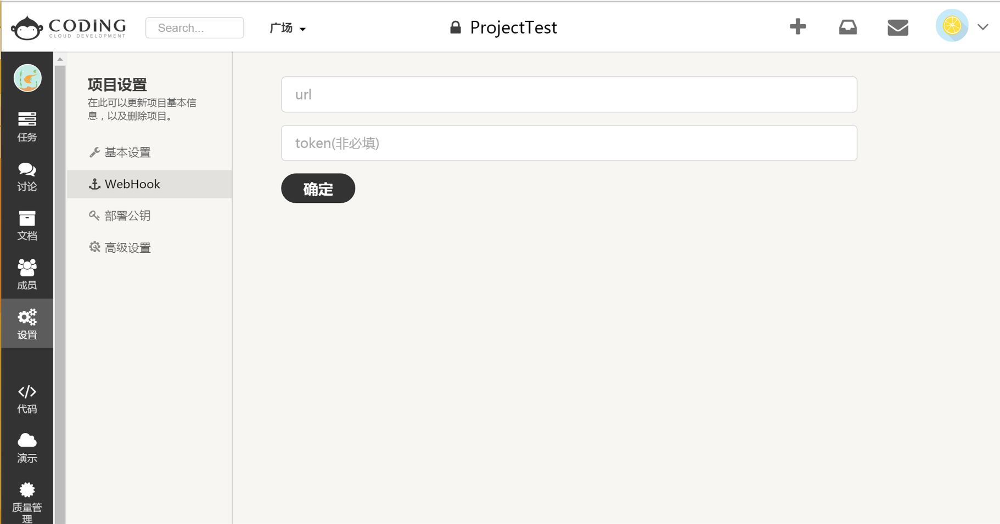

**First Step** To enable notifications for Coding.net, locate project settings. Select WebHook to add a new one.

**Second Step** Copy & paste the following link to the input box: [LOCALE_LINK](#)
Save and Talk will receive relative notification from Coding.net.

**Third Step** Go back here, customize name, description and icon, then save your preference. Coding.net integration message will be pushed to your selected topic as the screenshot below.

