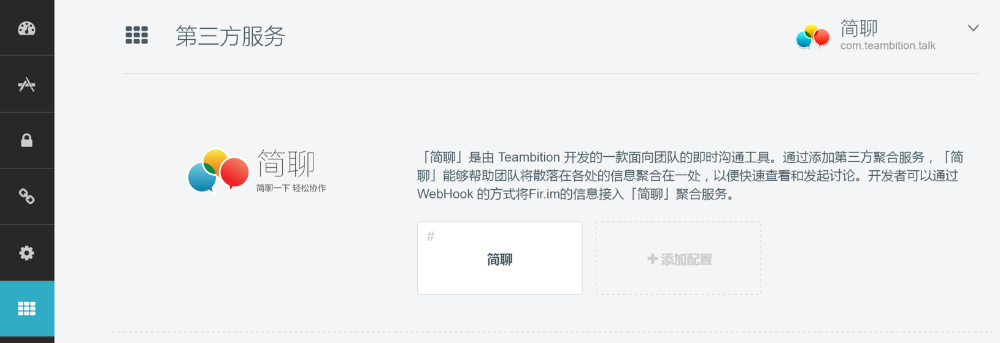
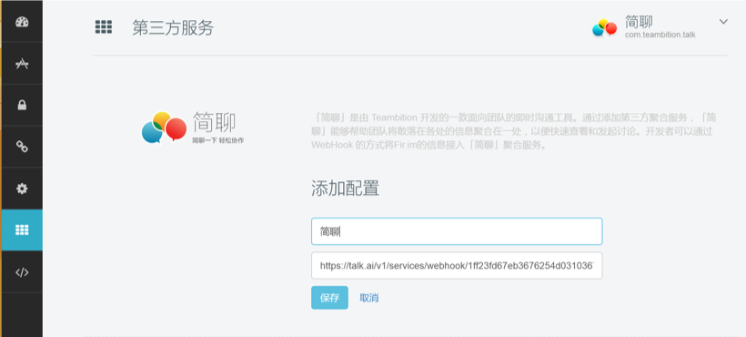

**First Step** Locate my apps at FIR.im, and select the project that you want to get notified.

**Second Step** Select third-party service, locate Talk, then configure integration.

**Third Step** Copy and paste the following link to the input box: [LOCALE_LINK](#)
Save and Talk will receive relative notification from Fir.im.

**Forth Step** Customize name, description and icon at Talk integration settings, and save your preference. Fir.im integration message will be pushed to selected topic as the picture below.

